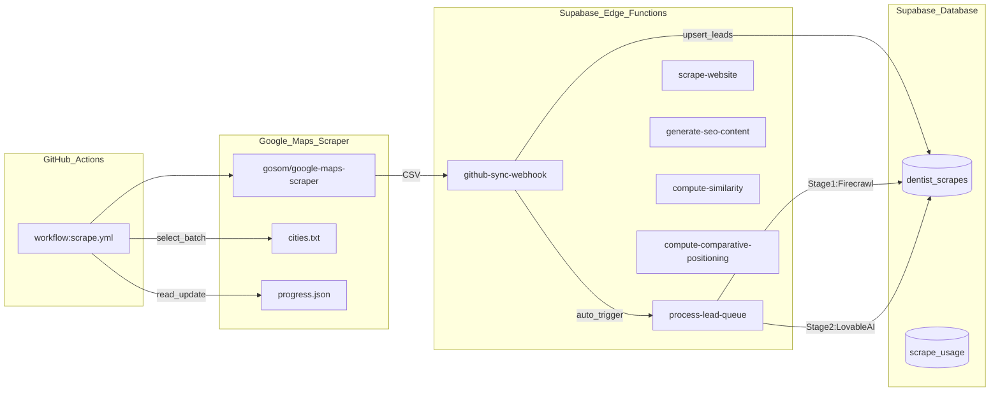

# Dentist Network Hub – Automation Pipeline Architecture

This document describes the fully automated pipeline that ingests dentist leads from Google Maps, scrapes their websites via Firecrawl, and generates SEO/GEO-optimized content via Lovable AI — all stored in `dentist_scrapes`.

## High-level data flow



## Edge Functions Summary

| Function | Purpose | Used by Main Pipeline |
|----------|---------|:---------------------:|
| `github-sync-webhook` | Ingests CSV from GitHub Actions, upserts to `dentist_scrapes`, triggers `process-lead-queue` | Yes |
| `process-lead-queue` | Orchestrator: Stage 1 scrapes websites via Firecrawl, Stage 2 generates SEO content via Lovable AI, writes all results back to `dentist_scrapes` | Yes |
| `scrape-website` | Standalone Firecrawl wrapper (used by `/admin/scrape-test` UI) | No |
| `generate-seo-content` | Standalone SEO generator (used by `/admin/scrape-test` UI) | No |
| `compute-similarity` | Content integrity check (used by `/admin/scrape-test` UI) | No |
| `compute-comparative-positioning` | Peer percentile comparison (used by `/admin/scrape-test` UI) | No |

## 1) GitHub Actions: Google Maps Scraping

- **Workflow file**: [`.github/workflows/scrape.yml`](../.github/workflows/scrape.yml)
- **Schedule**: every 8 hours (cron `0 2,10,18 * * *`) + manual trigger (`workflow_dispatch`)
- **Batching**:
  - Reads [`scraper/progress.json`](../scraper/progress.json) to determine `last_index`
  - Reads [`scraper/cities.txt`](../scraper/cities.txt) to build `scraper/batch_queries.txt`
  - Runs `gosom/google-maps-scraper` Docker container
- **Output**:
  - Writes `scraper/batch_results.csv`
  - POSTs the CSV to `github-sync-webhook`
  - Appends results into `scraper/all_results.csv`
  - Updates `scraper/progress.json`
  - Commits/pushes results

### Required GitHub Secrets

- **`SUPABASE_URL`**: e.g. `https://xxx.supabase.co`
- **`WEBHOOK_SECRET`**: passed as `Authorization: Bearer ${WEBHOOK_SECRET}`

## 2) `github-sync-webhook` (CSV Ingestion + Queue Trigger)

- **Source**: [`supabase/functions/github-sync-webhook/index.ts`](../supabase/functions/github-sync-webhook/index.ts)

### What it does

1. Authenticates via `WEBHOOK_SECRET`
2. Parses incoming CSV
3. Upserts each lead into `dentist_scrapes` (conflict key: `website`)
4. **Auto-triggers `process-lead-queue`** after successful inserts

### Auth model

- Expects `Authorization: Bearer ${WEBHOOK_SECRET}`
- Uses **service role** (`SUPABASE_SERVICE_ROLE_KEY`) for database writes

## 3) `process-lead-queue` (Pipeline Orchestrator)

- **Source**: [`supabase/functions/process-lead-queue/index.ts`](../supabase/functions/process-lead-queue/index.ts)

### What it does

The orchestrator processes leads in two stages:

**Stage 1 — Website Scraping (Firecrawl)**
- Fetches `dentist_scrapes` rows where `has_content = false`
- Calls Firecrawl API to scrape each website
- Stores the markdown in `text_content` column
- Sets `has_content = true`

**Stage 2 — SEO Content Generation (Lovable AI)**
- Fetches `dentist_scrapes` rows where `has_content = true` but SEO columns are empty
- Calls Lovable AI gateway to generate SEO content
- Stores results directly in `dentist_scrapes` columns:
  - `seo_title`
  - `seo_description`
  - `profile_content`
  - `faq` (JSONB)
  - `quotable_facts` (JSONB)
  - `authority_signals` (JSONB)
  - `schema_json_ld` (JSONB)

### Required Supabase Function Env Vars

- **`FIRECRAWL_API_KEY`**: for website scraping
- **`LOVABLE_API_KEY`**: for SEO content generation
- **`SUPABASE_URL`** + **`SUPABASE_SERVICE_ROLE_KEY`**: for database access

## 4) Standalone Edge Functions (UI Testing Only)

These functions are **not** used by the main automated pipeline. They power the `/admin/scrape-test` page for manual testing and development.

### `scrape-website`

- **Source**: [`supabase/functions/scrape-website/index.ts`](../supabase/functions/scrape-website/index.ts)
- Standalone Firecrawl wrapper
- Logs usage to `scrape_usage` table

### `generate-seo-content`

- **Source**: [`supabase/functions/generate-seo-content/index.ts`](../supabase/functions/generate-seo-content/index.ts)
- Standalone SEO generator via Lovable AI
- Returns structured content (does not persist)

### `compute-similarity`

- **Source**: [`supabase/functions/compute-similarity/index.ts`](../supabase/functions/compute-similarity/index.ts)
- Content integrity check (flags if generated content is too similar to source)

### `compute-comparative-positioning`

- **Source**: [`supabase/functions/compute-comparative-positioning/index.ts`](../supabase/functions/compute-comparative-positioning/index.ts)
- Generates percentile-based comparative statements using peer data

## 5) Database Schema

### Primary Table: `dentist_scrapes`

This single table stores the complete lead lifecycle — from raw Google Maps data through final SEO content.

| Column | Type | Purpose |
|--------|------|---------|
| `id` | SERIAL | Primary key |
| `website` | TEXT | Unique constraint, upsert key |
| `city` | TEXT | Extracted from address |
| `email` | TEXT | First email from Google Maps |
| `batch_number` | INTEGER | Groups leads by scrape batch |
| `scraped_at` | TIMESTAMP | When Google Maps data was ingested |
| `has_email` | BOOLEAN | Quick filter flag |
| `text_content` | TEXT | Website markdown from Firecrawl |
| `has_content` | BOOLEAN | Indicates Firecrawl completed |
| `seo_title` | TEXT | Generated SEO title |
| `seo_description` | TEXT | Generated meta description |
| `profile_content` | TEXT | Generated profile markdown |
| `faq` | JSONB | Generated FAQ array |
| `quotable_facts` | JSONB | LLM-quotable statements |
| `authority_signals` | JSONB | Confidence-weighted credibility markers |
| `schema_json_ld` | JSONB | Structured data for search engines |

### Supporting Tables

- **`scrape_usage`**: Tracks Firecrawl API calls (for standalone function only)

### Legacy/Unused Tables

The following tables exist from earlier iterations but are **not used by the main pipeline**:

- `generated_content` — linked to `business_leads`, not `dentist_scrapes`
- `authority_signals` (table) — separate from JSONB column in `dentist_scrapes`
- `comparative_positioning` — used by standalone function only
- `content_integrity` — used by standalone function only
- `business_leads` — from older lead extraction workflow

## 6) Current Gap

### Self-Continuation Loop Not Implemented

After processing a batch of leads, `process-lead-queue` returns:

```json
{
  "success": true,
  "should_continue": true,
  "processed": 10,
  "remaining": 150
}
```

However, it does **not** currently self-invoke to process the next batch. The caller (or a scheduler) would need to re-trigger the function until `should_continue: false`.

**Potential solutions**:
- Add a pg_cron job that periodically calls `process-lead-queue`
- Have the GitHub Action call `process-lead-queue` in a loop after CSV ingestion
- Implement recursive self-invocation within the edge function

## 7) Manual Testing

### Test Full Pipeline

1. Trigger GitHub Action manually:
   - GitHub → Actions → "Daily Dentist Scraper" → "Run workflow"
2. Verify `dentist_scrapes` rows are created with `has_content = false`
3. Verify `process-lead-queue` is triggered and populates:
   - `text_content` (Stage 1)
   - SEO columns (Stage 2)

### Test Standalone GEO Functions

1. Run the app and navigate to `/admin/scrape-test`
2. Enter a URL and click "Scrape Website"
3. Click "Generate SEO Content"
4. Observe similarity check and comparative positioning results
