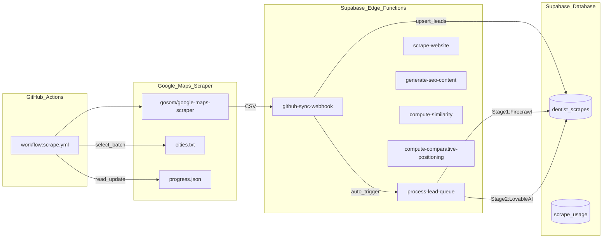

# Dentist Network Hub – Automation Pipeline Architecture

This document describes the fully automated pipeline that ingests dentist leads from Google Maps, scrapes their websites via Firecrawl, and generates SEO-optimized content via Lovable AI — all stored in `dentist_scrapes`.

## High-level data flow



## Edge Functions Summary

| Function | Purpose | Used by Main Pipeline |
|----------|---------|:---------------------:|
| `github-sync-webhook` | Ingests CSV from GitHub Actions, upserts to `dentist_scrapes`, triggers `process-lead-queue` | Yes |
| `process-lead-queue` | Orchestrator: Stage 1 scrapes websites via Firecrawl, Stage 2 generates SEO content via Lovable AI | Yes |
| `scrape-website` | Standalone Firecrawl wrapper (used by `/admin/scrape-test` UI) | No |
| `generate-seo-content` | Standalone SEO generator (used by `/admin/scrape-test` UI) | No |
| `compute-similarity` | Content integrity check (used by `/admin/scrape-test` UI) | No |
| `compute-comparative-positioning` | Peer percentile comparison (used by `/admin/scrape-test` UI) | No |

## 1) GitHub Actions: Google Maps Scraping

- **Workflow file**: [`.github/workflows/scrape.yml`](../.github/workflows/scrape.yml)
- **Schedule**: every 8 hours (cron `0 2,10,18 * * *`) + manual trigger (`workflow_dispatch`)
- **Batching**:
  - Reads [`scraper/progress.json`](../scraper/progress.json) to determine `last_index`
  - Reads [`scraper/cities.txt`](../scraper/cities.txt) to build `scraper/batch_queries.txt`
  - Runs `gosom/google-maps-scraper` Docker container
- **Output**:
  - Writes `scraper/batch_results.csv`
  - POSTs the CSV to `github-sync-webhook`
  - Appends results into `scraper/all_results.csv`
  - Updates `scraper/progress.json`
  - Commits/pushes results

### Required GitHub Secrets

- **`SUPABASE_URL`**: e.g. `https://xxx.supabase.co`
- **`WEBHOOK_SECRET`**: passed as `Authorization: Bearer ${WEBHOOK_SECRET}`

## 2) `github-sync-webhook` (CSV Ingestion + Queue Trigger)

- **Source**: [`supabase/functions/github-sync-webhook/index.ts`](../supabase/functions/github-sync-webhook/index.ts)

### What it does

1. Authenticates via `WEBHOOK_SECRET`
2. Parses incoming CSV
3. Upserts each lead into `dentist_scrapes` (conflict key: `place_id` if available, fallback to `website`)
4. **Auto-triggers `process-lead-queue`** with `stage: 'scrape'` after successful inserts

### Auth model

- Expects `Authorization: Bearer ${WEBHOOK_SECRET}`
- Uses **service role** (`SUPABASE_SERVICE_ROLE_KEY`) for database writes

## 3) `process-lead-queue` (Pipeline Orchestrator)

- **Source**: [`supabase/functions/process-lead-queue/index.ts`](../supabase/functions/process-lead-queue/index.ts)

### What it does

The orchestrator processes leads in two stages:

**Stage 1 — Website Scraping (Firecrawl)**

Query conditions:
```sql
(scrape_status IS NULL OR scrape_status = 'pending')
AND text_content IS NULL
LIMIT 5
```

Processing:
- Calls Firecrawl API for each website (2000ms delay between requests)
- Updates record:
  - `text_content`: scraped markdown
  - `has_content`: true
  - `scrape_status`: 'scraped'
  - `scraped_at`: timestamp

On failure:
- Sets `scrape_status`: 'failed'
- Sets `processing_error`: error message

**Stage 2 — SEO Content Generation (Lovable AI)**

Query conditions:
```sql
scrape_status = 'scraped'
AND text_content IS NOT NULL
LIMIT 5
```

Processing:
- Calls Lovable AI (gemini-2.5-flash) for each lead (1000ms delay between requests)
- Updates record:
  - `seo_title`: generated title
  - `seo_description`: generated meta description
  - `profile_content`: generated profile markdown
  - `services`: JSON array of services offered
  - `unique_features`: JSON array of differentiators
  - `faq`: JSON array of {question, answer} pairs
  - `scrape_status`: 'processed'
  - `processed_at`: timestamp

On failure:
- Status remains 'scraped' (allows retry on next run)
- Logs error but continues processing batch

### Rate Limiting

| Service | Delay | Constant |
|---------|-------|----------|
| Firecrawl | 2000ms | `FIRECRAWL_DELAY_MS` |
| Lovable AI | 1000ms | `AI_DELAY_MS` |
| Batch Size | 5 leads | `BATCH_SIZE` |

### Required Supabase Function Env Vars

- **`FIRECRAWL_API_KEY`**: for website scraping
- **`LOVABLE_API_KEY`**: for SEO content generation
- **`SUPABASE_URL`** + **`SUPABASE_SERVICE_ROLE_KEY`**: for database access

## 4) Standalone Edge Functions (UI Testing Only)

These functions are **not** used by the main automated pipeline. They power the `/admin/scrape-test` page for manual testing and development.

### `scrape-website`

- **Source**: [`supabase/functions/scrape-website/index.ts`](../supabase/functions/scrape-website/index.ts)
- Standalone Firecrawl wrapper
- Logs usage to `scrape_usage` table

### `generate-seo-content`

- **Source**: [`supabase/functions/generate-seo-content/index.ts`](../supabase/functions/generate-seo-content/index.ts)
- Standalone SEO generator via Lovable AI
- Returns structured content (does not persist)

### `compute-similarity`

- **Source**: [`supabase/functions/compute-similarity/index.ts`](../supabase/functions/compute-similarity/index.ts)
- Content integrity check (flags if generated content is too similar to source)

### `compute-comparative-positioning`

- **Source**: [`supabase/functions/compute-comparative-positioning/index.ts`](../supabase/functions/compute-comparative-positioning/index.ts)
- Generates percentile-based comparative statements using peer data

## 5) Database Schema

### Primary Table: `dentist_scrapes`

This single table stores the complete lead lifecycle — from raw Google Maps data through final SEO content.

| Column | Type | Purpose |
|--------|------|---------|
| **Identity** |||
| `id` | SERIAL | Primary key |
| `place_id` | TEXT | Google Maps unique ID (primary conflict key) |
| `website` | TEXT | Business website (required, fallback conflict key) |
| **Google Maps Data** |||
| `business_name` | TEXT | Practice name |
| `phone` | TEXT | Phone number |
| `email` | TEXT | Email if found |
| `rating` | NUMERIC | Google rating (1-5) |
| `review_count` | INTEGER | Number of reviews |
| `latitude` | NUMERIC | Coordinates |
| `longitude` | NUMERIC | Coordinates |
| `category` | TEXT | Business category |
| `open_hours` | TEXT | Operating hours |
| `google_maps_link` | TEXT | Maps URL |
| **Location** |||
| `city` | TEXT | Extracted from address or input_id |
| `city_id` | INTEGER | Reference to cities table |
| **Processing State** |||
| `scrape_status` | TEXT | pending → scraped → processed / failed |
| `processing_error` | TEXT | Last error message |
| `retry_count` | INTEGER | Number of retry attempts |
| **Raw Content** |||
| `text_content` | TEXT | Scraped website markdown |
| `has_content` | BOOLEAN | Whether scrape succeeded |
| `has_email` | BOOLEAN | Whether email was found |
| **SEO Content** |||
| `seo_title` | TEXT | Generated page title |
| `seo_description` | TEXT | Generated meta description |
| `profile_content` | TEXT | Generated business profile |
| `services` | JSONB | Array of services offered |
| `unique_features` | JSONB | Array of differentiators |
| `faq` | JSONB | Array of {question, answer} |
| **Timestamps** |||
| `created_at` | TIMESTAMPTZ | Record creation |
| `scraped_at` | TIMESTAMPTZ | When Firecrawl completed |
| `processed_at` | TIMESTAMPTZ | When SEO generation completed |
| **Batch Tracking** |||
| `batch_number` | INTEGER | Groups leads by import batch |

### State Machine

```
┌─────────┐    Firecrawl    ┌─────────┐    Lovable AI    ┌───────────┐
│ pending │ ──────────────► │ scraped │ ───────────────► │ processed │
└─────────┘                 └─────────┘                  └───────────┘
     │                           │
     │         Error             │         (retry on next run)
     ▼                           │
┌─────────┐                      │
│ failed  │ ◄────────────────────┘
└─────────┘
```

### Supporting Tables

- **`scrape_usage`**: Tracks Firecrawl API calls (for standalone function only)

### Legacy/Unused Tables

The following tables exist from earlier iterations but are **not used by the main pipeline**:

- `generated_content` — linked to `business_leads`, not `dentist_scrapes`
- `authority_signals` (table) — separate from `dentist_scrapes`
- `comparative_positioning` — used by standalone function only
- `content_integrity` — used by standalone function only
- `business_leads` — from older lead extraction workflow

## 6) Current Gap

### Self-Continuation Loop Not Implemented

After processing a batch of leads, `process-lead-queue` returns:

```json
{
  "success": true,
  "should_continue": true,
  "processed": 5,
  "remaining": { "scrape": 150, "generate": 45 }
}
```

However, it does **not** currently self-invoke to process the next batch. The caller (or a scheduler) would need to re-trigger the function until `should_continue: false`.

**Recommended solution** — Add self-invocation at end of `process-lead-queue`:

```typescript
if (shouldContinue) {
  const supabaseUrl = Deno.env.get('SUPABASE_URL');
  const serviceKey = Deno.env.get('SUPABASE_SERVICE_ROLE_KEY');
  
  // Determine next stage: if no more to scrape, switch to generate
  const nextStage = stage === 'scrape' && remainingScrape === 0 ? 'generate' : stage;
  
  fetch(`${supabaseUrl}/functions/v1/process-lead-queue`, {
    method: 'POST',
    headers: {
      'Authorization': `Bearer ${serviceKey}`,
      'Content-Type': 'application/json'
    },
    body: JSON.stringify({ stage: nextStage, batch_size: BATCH_SIZE })
  }).catch(err => console.error('Self-continuation failed:', err));
}
```

**Alternative solutions**:
- Add a pg_cron job that periodically calls `process-lead-queue`
- Have the GitHub Action call `process-lead-queue` in a loop after CSV ingestion

## 7) Manual Testing

### Test Full Pipeline

1. Trigger GitHub Action manually:
   - GitHub → Actions → "Daily Dentist Scraper" → "Run workflow"
2. Verify `dentist_scrapes` rows are created with `scrape_status = 'pending'`
3. Verify `process-lead-queue` is triggered and populates:
   - `text_content`, `scraped_at` (Stage 1)
   - SEO columns, `processed_at` (Stage 2)

### Test Standalone Functions

1. Run the app and navigate to `/admin/scrape-test`
2. Enter a URL and click "Scrape Website"
3. Click "Generate SEO Content"
4. Observe similarity check and comparative positioning results
